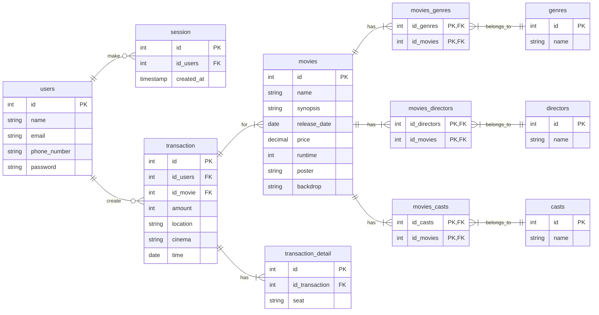

# Database - Weekly

This project was made by Muhammad Davinda Rinaldy in Training Program held by Kodacademy to make ERD of tickitz project, using mermaid tool and Query Database, using PostgreSQL.

## Entity Relationship Diagram 
